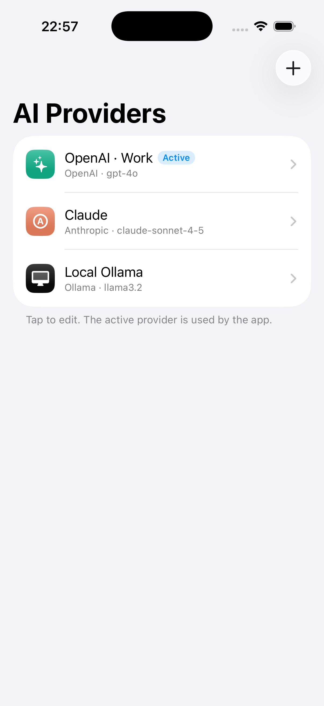
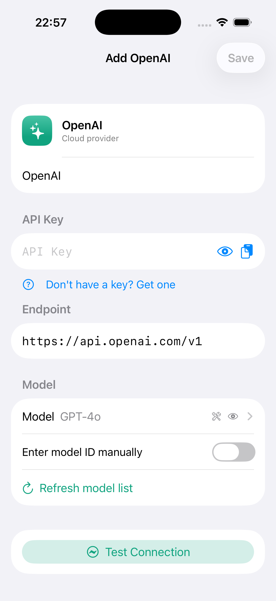
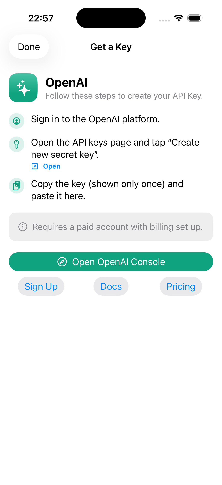

<div align="center">

# BYOKit

### Bring Your Own Key, beautifully.

A Swift Package that gives any **iOS / iPadOS / macOS** app a production-grade
**BYOK (Bring Your Own Key)** LLM configuration experience — in one line.

[](https://github.com/everettjf/BYOKit)
[](https://swift.org)
[](https://www.swift.org/package-manager/)
[](https://github.com/everettjf/BYOKit/actions/workflows/ci.yml)
[](LICENSE)

**[📖 Documentation &amp; site →](https://everettjf.github.io/BYOKit/)**





</div>

---

```swift
import BYOKit

BYOKSettingsView()
    .environmentObject(store)            // a ConfigurationStore
    .byokClient(DefaultLLMClient())    // or your own LLMClient
```

## Why

The hard part of supporting multiple LLM providers isn't *calling* them — there
are many good libraries for that ([AnyLanguageModel](https://github.com/mattt/AnyLanguageModel),
[SwiftOpenAI](https://github.com/jamesrochabrun/SwiftOpenAI), …). It's the
**configuration UX**: per-provider onboarding with deep links, key validation,
one-tap connection testing, custom base URLs, and multi-key management. Every
app rebuilds it by hand. BYOKit ships it.

## Features

- **One-line settings center** — list, add, edit, reorder, delete, choose the active provider.
- **Per-provider onboarding** — structured "get a key" guide with steps, notes, and deep links (console / sign-up / docs / pricing).
- **Secure by default** — keys go to the Keychain; the UI masks them; "Test Connection" uses a minimal request.
- **Data-driven catalog** — add a provider by editing `providers.json`; no UI code. Ships built-in, optionally overridden by a remote OTA JSON.
- **Swappable engine** — `DefaultLLMClient` (URLSession, zero deps) speaks OpenAI, Anthropic, Gemini, and Ollama. Conform to `LLMClient` to use anything else.
- **Adaptive & themeable** — looks right on iPhone, iPad, and Mac; matches your app's style.

## Built-in providers

OpenAI · Anthropic · Google Gemini · DeepSeek · OpenRouter · Groq · Mistral ·
xAI (Grok) · Ollama (local) · Custom (any OpenAI-compatible endpoint).

Each ships with brand styling, key validation, model presets, and a full
onboarding guide.

## Install

```swift
.package(url: "https://github.com/everettjf/BYOKit", from: "1.0.0")
```

Add the `BYOKit` product (umbrella). For just the data layer, depend on
`BYOKitCore`; for just the UI, `BYOKitUI`.

**Requirements:** iOS 17 / iPadOS 17 / macOS 14, Swift 6.1 toolchain.

## Usage

```swift
@main
struct MyApp: App {
    @StateObject private var store = ConfigurationStore()   // Keychain + UserDefaults

    var body: some Scene {
        WindowGroup {
            BYOKSettingsView()
                .environmentObject(store)
                .byokClient(DefaultLLMClient())
        }
    }
}
```

Send a request with the active configuration:

```swift
if let config = store.activeConfiguration,
   let provider = await ProviderRegistry.shared.provider(config.providerID) {
    let resolved = ResolvedConfiguration(
        provider: provider,
        configuration: config,
        apiKey: store.apiKey(for: config.id)
    )
    let response = try await DefaultLLMClient()
        .complete(.text("Hello"), with: resolved)
    print(response.text)
}
```

### Customization

```swift
BYOKSettingsView()
    .byokProviders(.only(.openAI, .anthropic, .ollama))   // limit providers
    .byokTheme(BYOKTheme(accent: .pink, cornerRadius: 16))
    .byokShowsOnboarding(true)
    .byokClient(myCustomClient)
```

### Reusable pieces

`ProviderPickerView`, `ProviderConfigForm`, `OnboardingGuideView`,
`ConnectionTestButton`, `KeyField`, and `ProviderBadge` are all public and usable
on their own.

## Architecture

| Target | Role | Dependencies |
|---|---|---|
| `BYOKitCore` | Models, provider registry, onboarding metadata, `providers.json` | none |
| `BYOKitStore` | Keychain credential store + configuration persistence | Core |
| `BYOKitClient` | `LLMClient` protocol + `DefaultLLMClient` (URLSession) | Core |
| `BYOKitUI` | SwiftUI components | Core, Store, Client |
| `BYOKit` | Umbrella re-export | all |

`BYOKitCore` has **zero third-party dependencies**. Nothing pulls in a heavy SDK
unless you choose to write an adapter.

## Example app

`Example/` contains a multi-platform SwiftUI demo.

```bash
cd Example
xcodegen generate           # needs `brew install xcodegen`
open BYOKitDemo.xcodeproj
```

## Testing

```bash
swift test
```

32 tests cover the registry, key validation, Keychain round-trips, the store, and
all four API formats (via a stubbed `URLProtocol`). Set `ROCKY_OPENAI_APIKEY` to
also run two live OpenAI smoke tests (skipped otherwise). The package is build-
verified on macOS and the iOS/iPadOS simulator SDKs.

## Roadmap

- [x] **M1/M2** — Core models, Keychain store, URLSession client, full SwiftUI configuration UI.
- [ ] **M3** — Optional `AnyLanguageModel` adapter (local MLX / Foundation Models) behind `LLMClient`.
- [ ] Streaming completions; usage/quota hints.
- [ ] DocC API reference on the docs site.
- [ ] Localization (zh-Hans first).

## Contributing

Issues and PRs welcome. Adding a provider is usually just an entry in
[`Sources/BYOKitCore/Resources/providers.json`](Sources/BYOKitCore/Resources/providers.json) —
no code required.

## License

MIT © Everett. See [LICENSE](LICENSE).
